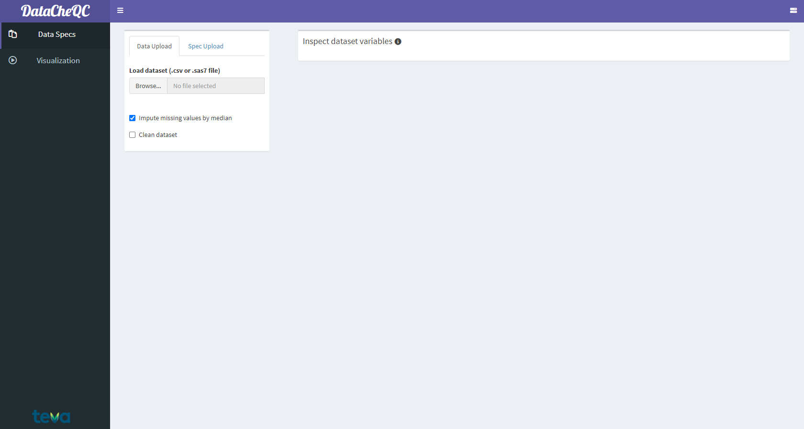
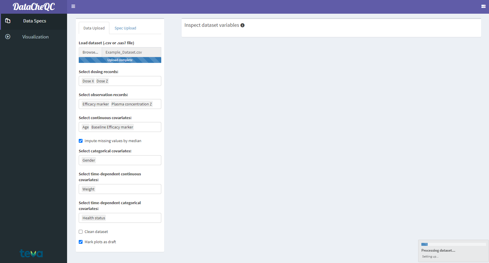

```{r setup, include=FALSE}
knitr::opts_chunk$set(echo = T, eval = F)
```

## Loading the Dataset

------------------------------------------------------------------------

After making sure that [the dataset is in the correct format](./input_format.html), open the app either [locally](./index.html#Getting_Started) or [online](http://dotanor.shinyapps.io/DataCheQC). At the app landing page, you can upload a dataset (either as a .csv or .sas7bdat file) via the **Browse...** button or by dragging and dropping the file in the space next to it.



<br>

## Automatic Variable Detection

------------------------------------------------------------------------

After the file has been uploaded, the app will attempt to identify its components:

-   Dosing

    -   Derived from rows where TYPENAME = "DOSE"

-   Observations

    -   Derived from TYPENAME = "PK" or "PD"

-   Continuous covariates

    -   Derived from typical covariate names such as Weight and Age, or determined by TYPENAME

-   Categorical covariates

    -   Derived from typical covariates such as Ethnicity and Gender, or determined by TYPENAME

-   Time-dependent continuous/categorical covariates

    -   Derived from the typical covariates that match the above but change over time for the same subject

If there are still variables in the data that weren't included automatically, you can select and add them manually by clicking on the appropriate selection input.

<br>



<br>

## Additional Options

Users can also perform some optional actions, such as imputing continuous covariates by their median, adding a "DRAFT" watermark to some plots, and cleaning the dataset. These options can be set both before and after a file has been uploaded.

Cleaning functions include:

-   Remove missing observation records with missing TIME

-   Set missing observation records with missing DV to IGNORE

-   Remove non-dose and non-observation records

-   Remove subjects without observations

-   Remove dose records with AMT = 0

-   Remove ignored records (MDV=1)

## Next Steps

------------------------------------------------------------------------

In order to be able to produce the various [visual analyses](./eda_st.html) offered by DataCheQC, the app needs to perform certain calculations on the data. This can take from a few seconds to several minutes, depending on file size. The notification at the bottom-right of the screen shows the progress of the operation, as shown in the image above.

Fortunately, the app conducts this procedure in a background process, which allows the user to start on the next step in the QC workflow - [comparing the dataset to the specification file](./dataset_qc.html) - as soon the file itself has been uploaded to the app.[^1]

[^1]: Indicated by the progress bar below the file upload input reading "Upload Complete".
