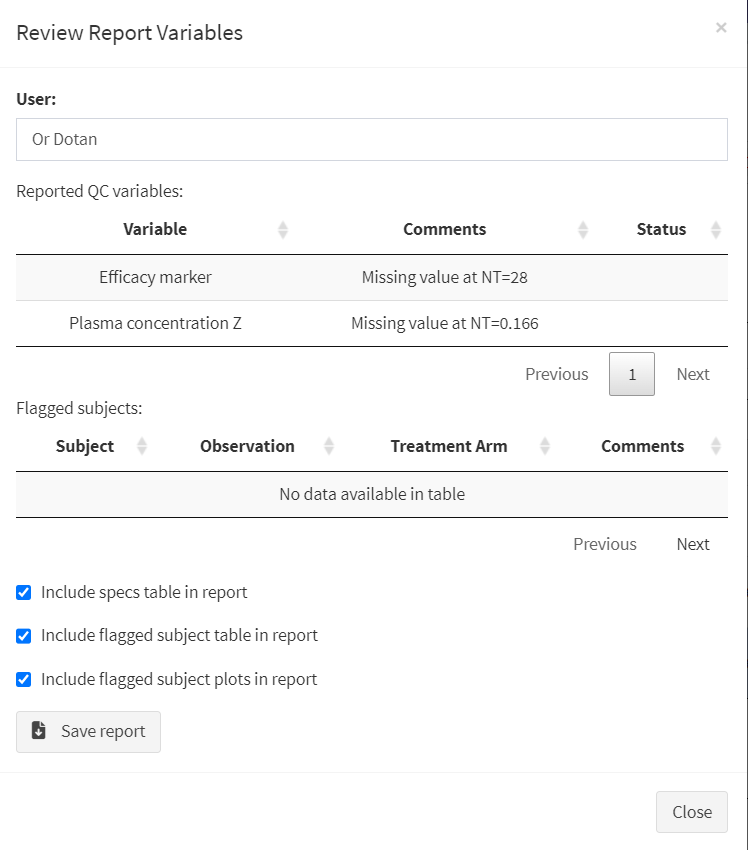

```{r setup, include=FALSE}
knitr::opts_chunk$set(echo = T, eval = F)

#from https://bookdown.org/yihui/rmarkdown-cookbook/font-color.html
colorize <- function(x, color) {
  if (knitr::is_latex_output()) {
    sprintf("\\textcolor{%s}{%s}", color, x)
  } else if (knitr::is_html_output()) {
    sprintf("<span style='color: %s;'>%s</span>", color,
      x)
  } else x
}
```

## Uploading the Specification File

------------------------------------------------------------------------

After uploading the dataset file, use the "Spec Upload" tab to access the specification file upload screen. Upload a specification file (either .docx and .xlsx format) via the **Browse...** button or by dragging and dropping the file in the space next to it.

{.img-toggle}

## Comparison with the General/Event Table

------------------------------------------------------------------------

After the specification file has been uploaded, multiple options will be revealed:

-   **"Switch to event table"**: toggle between viewing the specification General and Event Tables, which cover dataset columns and events/observations respectively.

-   **"Filter optional variables / variables requiring input from the pharmacometrician"**: Filter out variables according to these criteria (if those columns are included in the specification file).<sup class="footref">1</sup>

To the right, the selection bar allows the user to select multiple items for review, which will reveal two tables:

-   **Data summary table (Top)**

    -   Contains a description of each variable's unique values and their amount, the type of data (numeric, character, etc.) and the number of NA or blank values

    -   Variables that have multiple missing values will be marked in [***yellow***]{.color-hover style="--text-color: #f4ecb3;"}

    -   Variables that have conflicting information (e.g., different units for the same observation) will be marked in [***red***]{.color-hover style="--text-color: red"}

-   **Specification for the chosen variables (Bottom)**

    -   Contains the parts of the specification file that correspond to the selected items and includes their type, label, typical values and other information

    -   Allows for comparison between the data summary and the specification on a per-item basis

-   If a chosen item from the specification file is not present in the data, it will be `r colorize("_italiczed and colored red_", "red")`


### Further Inspection

------------------------------------------------------------------------

If one or more items look to be defined incorrectly or have unexpected missing values, the user can look deeper into them by clicking on their corresponding row in the top table. This reveals several options:

-   **"Review NA rows"**: If the item(s) contain NA/missing values, clicking this button will show the actual rows in the dataset where this is the case, allowing the user to look for patterns (e.g., values only missing for a specific subject or timepoint) and verify that the relevant values are indeed missing.


-   **"Compare and align variables"**: This option becomes available when selecting two or more items. Clicking this button opens up a table where each unique value per item is compared to the other selections. This can be useful for checking whether variables that are derived from other columns in the data match the derivation as defined in the specification file (for example, if TRTNAME and TRT or TIME and TIMEUNIT match consistently).<sup class="footref">1</sup>


-   **"Add Selected variables to QC report"**: will add all selected items to the QC report, which can be reviewed and edited by clicking the **"Review reported variables"** button.

## Building the QC Report

------------------------------------------------------------------------

After clicking on *"Review reported variables"*, the QC report review screen will be shown. Users must enter their name at the top, and then edit the table of reported items by double clicking the corresponding cell and writing in any conclusions drawn from the comparison process.



After completing this part of the QC report, users can move on to [conducting visual checks and reviewing summary data](./eda_st.html).

------------------------------------------------------------------------

1.  These options are only available when viewing the General Table.<a id="footback">↩︎</a>
