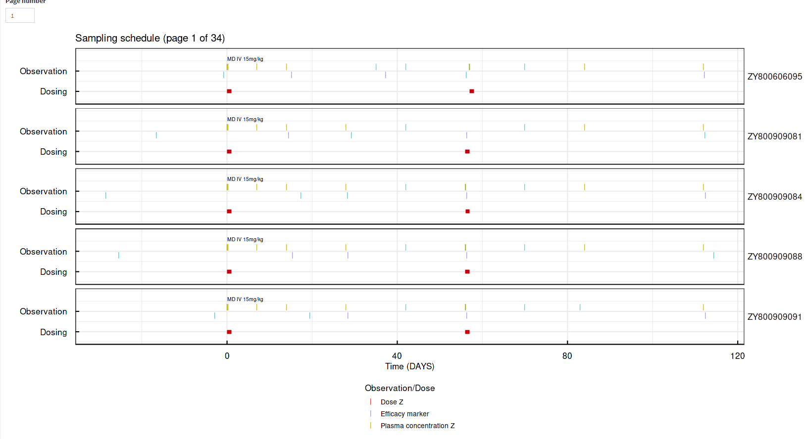

```{r setup, include=FALSE}
knitr::opts_chunk$set(echo = T, eval = F)
```

## The Visualization Tab

------------------------------------------------------------------------

Once the app has finished processing the uploaded dataset, the user can move into reviewing summary tables and some visual analyses by clicking on the **"Visualization"** tab located on the left side of the screen.

The following functions are available, denoted by the tabs at the top of screen:

-   `r shiny::HTML('<a class = "example-link" style="align-items: baseline;" href="#summary-tables">Summary Tables</a>')`

-   `r shiny::HTML('<a class = "example-link" style="align-items: baseline;" href="#graphical-exploration">Graphical Exploration</a>')`


### Download Options

------------------------------------------------------------------------

When dataset processing is completed, more features are enabled by clicking on the icon at the top left of the screen:

-   **Download analysis dataset**: download the processed version of the dataset (processes can include pivoting of covariate observations into separate columns and data cleaning if that option was selected).

-   **Download most recent plot**: can be used to download the latest plot that was created using the app. Users can choose between .png and .svg file formats, or to generate both and download them as a .zip archive.


`r htmltools::tags$a(class = "example-link", href="www/example_analysis_dataset.csv", target="_blank", "Click here to download an example of a dataset after app processing", download = NA)`

## Summary Tables

------------------------------------------------------------------------

Choosing the **"Summary Table"** will reveal several tables that allow the user to review different aspects of the data:

-   **Analysis Dataset**: This table shows the version of the dataset after processing, and like the other tables it is searchable, paginated, and can be sorted by columns.

-   **Duplicated times, unanalyzed dataset**: shows which participants have conflicting VALUE measurements at the same TIME.

    

-   **Summary of covariates**: presents an overview of the distribution of covariates (both continuous and categorical) in the data, across the different STUDY values.

    

-   **Summary of observations:** summarizes observation data, such as the number of observations per study or subject, the amount of observations that are either below the lower limit of quantification (BLOQ), missing, ignored or included in the analysis.

    

## Graphical Exploration

------------------------------------------------------------------------

The "Graphical Exploration" tab offers multiple plots, split into three categories:

### Observation Plots

------------------------------------------------------------------------

-   **Spaghetti**: plot the selected observation over time for each participant, split by TRTNAME and optionally stratified by one or more covariates.

    -   **Focus on Individual Profiles**: clicking this option will show a grid plot for each participant in the same TRTNAME. This way, users can look into the individual profiles per group and note any participants that have missing or implausible values that can be flagged for inclusion in the QC report. To add an individual to the report, double click their plot.

        

    -   Once at least one subject has been flagged, the **"Review flagged subjects"** will be revealed. clicking on it allows the user to edit the participant information with informative comments that can be added to the final QC report.

        

-   **Median range over time**: shows a summary line across participants for the selected observation for each TRTNAME

    

<!-- -->

-   **Individual plots**: shows the observation-time plot of the selected individual

    

### Covariate Plots

------------------------------------------------------------------------

These plots are available for both continuous and categorical covariates.

-   **Covariate distribution** - graphical representation of the covariate distribution

    

<!-- -->

-   **Covariate correlation** - graphical representation of the correlations between covariates

    

### Timing Plots

------------------------------------------------------------------------

-   **Actual Time vs. Nominal Time:** compare actual vs nominal time. Ideally, these time measures should be similar if not identical to facilitate data summary across time. Therefor, they should be positively and highly correlated, and the differences between them should be centered around zero.

    

<!-- -->

-   **Dosing Schedule:** shows a breakdown, by participant, of dosing times; users can switch between various pages of the plot by using the counter near the top of the image. Additionally, as this plot might take some time to process, it will be calculated in parallel in the background which allows users to review other plots in the meantime.

    

<!-- -->

-   **Sampling Schedule**:shows a breakdown, by participant, of sampling times; users can switch between various pages of the plot by using the counter near the top of the image. Additionally, as this plot might take some time to process, it will be calculated in parallel in the background which allows users to review other plots in the meantime.

    

### Additional Options

------------------------------------------------------------------------

-   **Generate all graphs and tables**: clicking this button will generate each of the aforementioned plots and tables and download them as a time-stamped .zip archive file.

-   **Switch to Report Tab**: a shortcut that will take the user to the QC report tab to finalize report findings.

## Finalizing the QC Report

------------------------------------------------------------------------

At the **"Data Specs ➤ Spec Upload"** Tab, clicking the **"Review reported variables"** will bring up the current state of the report. Here, users can edit the report, and add or remove any relevant details, including choosing which elements should be included in the generated report (the three check-boxes at the bottom of the screen).

After the report is considered finished, clicking the **"Save Report"** button will download the QC report as a .docx file.


Additionally, a saved report file can be re-uploaded into the app by clicking the **"Upload Existing Report"**, allowing revisions and updates to the report to be conducted within the app.

`r htmltools::tags$a(class = "example-link", href="www/EXAMPLE_DATASET QC Report.docx", target="_blank", "Click here to download an example of a QC Report generated by the app", download = NA)`
